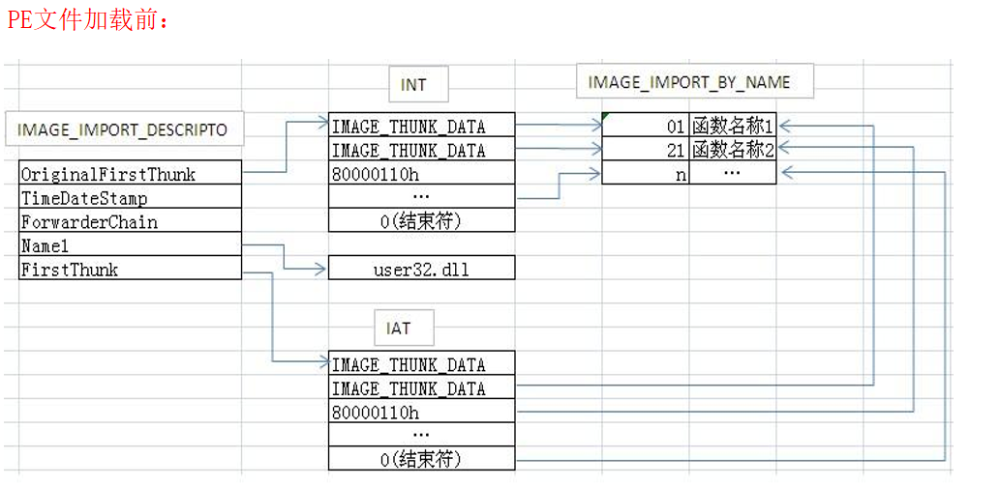
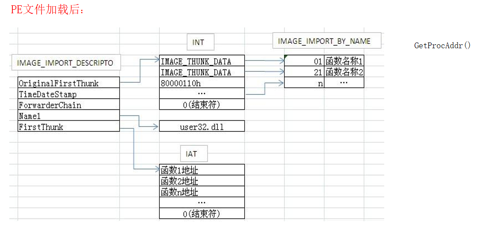
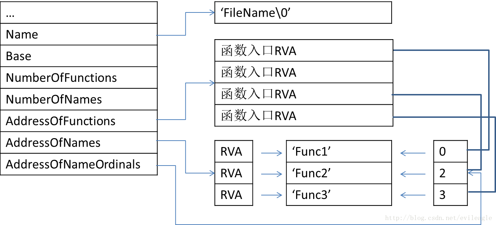
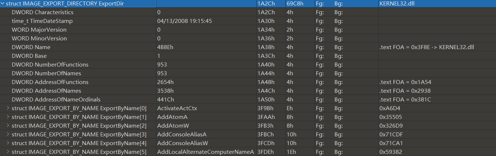
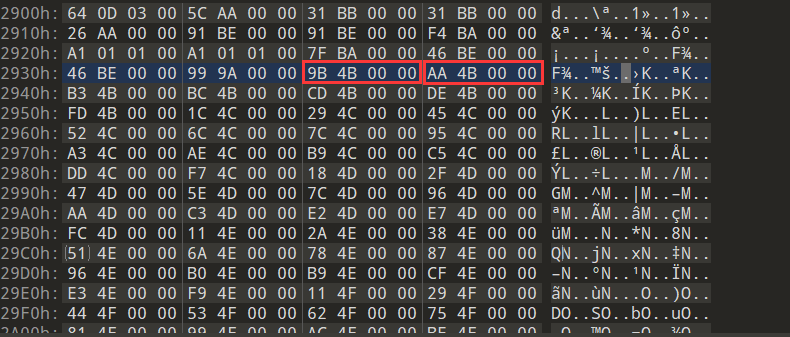
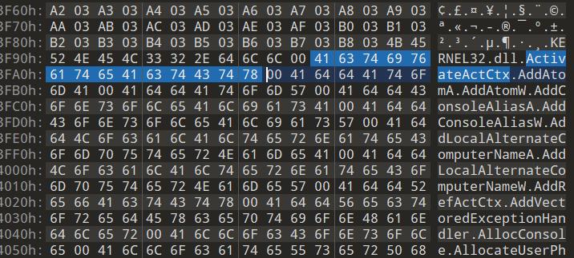
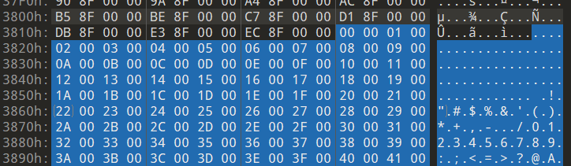
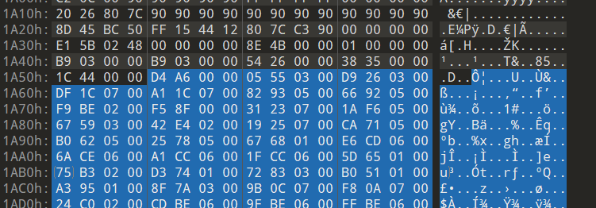
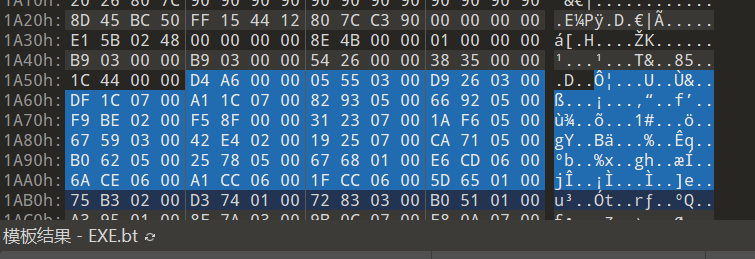
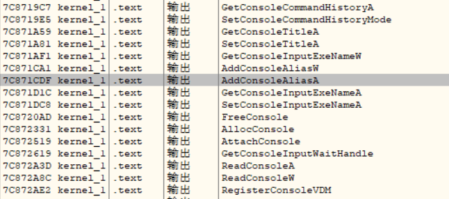

这一部分主要是PE相关，过了好几遍了，这次一定搞完。主要是后面的一些表，前面的就不太写了

# 第13章

dos头，dos存根，nt头，节表

**va = imagebase + rva**


NT头包含文件头和可选头

NT文件头：


NT可选头：


```c
AddressOfEntryPoint;//EP的RVA值
ImageBase;        //载入内存时优先装载的地址
SectionAlignment; //节区在内存中的最小单位
FileAlignment;    //节区在磁盘文件中的最小单位
SizeOfImage;   //指定了PE Image在虚拟内存中所占空间的大小，包含所有头
SizeOfHeaders; //整个PE头的大小
```

节表


```c
DWORD VirtualSize; //载入内存时此节区的大小
VirtualAddress;   //内存中节区起始地址(RVA)
SizeOfRawData;    //磁盘中节区所占大小
PointerToRawData; //磁盘中本节对于文件头的距离
```


## 接下里重要的IAT来了

**FOA = RVA - VirtualAddress + PointerToRawData**

vitualAddress 和 PointerToRawData都在节区表里

在NT头的可选NT头中的最后，找到导入表的RVA = 0x7604

所以，FOA = 0x6A04

重要的部分：

```c
DWORD OriginalFirstThunk; // INT address(RVA)，数组，指向IMAGE_IMPORT_BY_NAME结构体
DWORD Name;       //当前库名的地址(RVA)
DWORD FirstThunk; //IAT address(RVA)，数组，指向IMAGE_IMPORT_BY_NAME结构体
```

首先是INT和IAT导入的步骤：

1.  读`IMAGE_IMPORT_DESCRIPTOR`的`Name`成员获取库名称的字符串(比如’kernel32.dll’)
2.  装载相应的库，LoadLibrary(“kernel32.dll”)
3.  读`IMAGE_IMPORT_DESCRIPTOR`的`OriginalFirstThunk`成员，获得INT表的地址
4.  逐一获取INT数组的`IMAGE_IMPORT_BY_NAME`地址
5.  使用`IMAGE_IMPORT_BY_NAME`的hint或者name项，获取相应函数的起始地址
6.  读`IMAGE_IMPORT_DESCRIPTOR`的`FirstThunk`(IAT)，获取IAT的地址
7.  将上面获得的函数地址输入相应的IAT数组值
8.  重复4~7






## EAT


```c
typedef struct _IMAGE_EXPORT_DIRECTORY
{
    DWORD Characteristics;
    DWORD TimeDateStamp;
    WORD MajorVersion;
    WORD MinorVersion;
    DWORD Name;                  //要导出的名字的地址
    DWORD Base;                  //oridinal base
    DWORD NumberOfFunctions;     //实际导出函数个数
    DWORD NumberOfNames;         //导出函数中有名字的个数
    DWORD AddressOfFunctions;    //导出函数的地址(数组，RVA，元素个数=NumberOfFunctions )
    DWORD AddressOfNames;        //导出函数的名称的地址(数组，RVA，元素个数=NumberOfNames)
    DWORD AddressOfNameOrdinals; //导出函数序号表的地址(数组，RVA，元素个数=NumberOfNames)，函数序号表
} IMAGE_EXPORT_DIRECTORY, *PIMAGE_EXPORT_DIRECTORY;
```





获得函数地址的API为：`GetProcAddress`，原理：

>   1.  利用adressofname转到函数名称的数组
>   2.  上面的数组存着的是地址，通过strcmp，查到指定的函数名，这时索引记为name_index
>   3.  用addressofnameordinals转到ordinal数组，
>   4.  通过name_index查找相应index值
>   5.  利用addressoffunction转到 函数地址数组
>   6.  用ordinal找到需要函数的地址。


这里使用kernel32.dll来演示：



```c
AddressOfFunctions :   RVA = 0x2654  FOA = 0x1A54
AddressOfNames:        RVA = 0x3538  FOA = 0x2938
AddressOfNameOrdinals: RVA = 0x441C  FOA = 0x381C
```

AddressOfName，一个个的RVA，个数为953：




RVA = 4B9B ==> FOA = 3F9B



来找下AddConsoleAliasA函数，是第4个，索引为3，

查ordinal数组，foa = 0x381C



也是3，接下来就可以查实际地址了，

找addressofFunction：





第4个是0x071cdf，kernel32.dll的imagebase是0x7c800000，加起来是'0x7c871cdf'



没问题。
