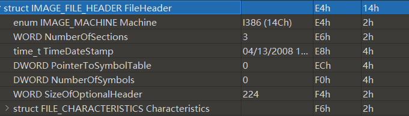
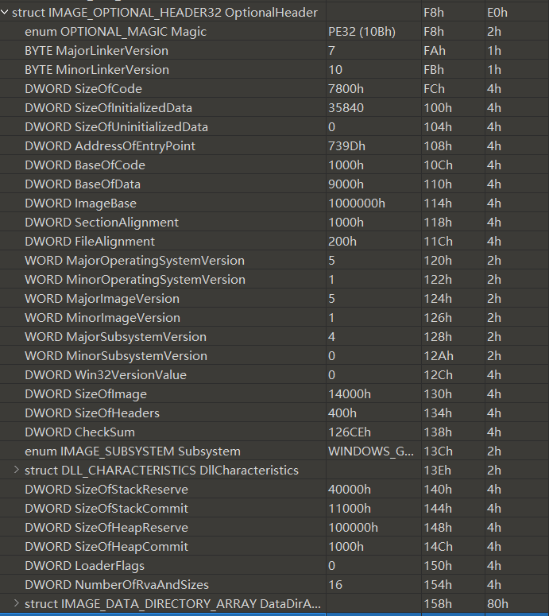
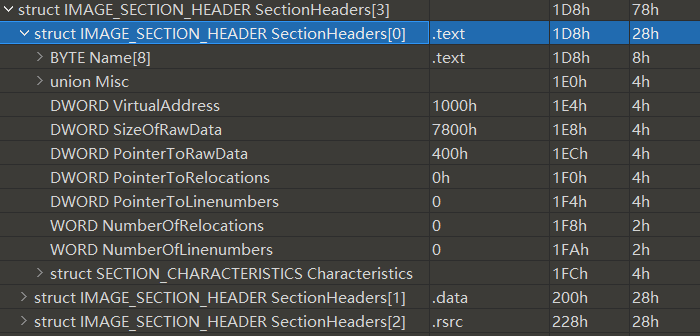

这一部分主要是PE相关，过了好几遍了，这次一定搞完。主要是后面的一些表，前面的就不太写了

# 第13章

dos头，dos存根，nt头，节表

**va = imagebase + rva**


NT头包含文件头和可选头

NT文件头：



NT可选头：



```c
AddressOfEntryPoint;//EP的RVA值
ImageBase;        //载入内存时优先装载的地址
SectionAlignment; //节区在内存中的最小单位
FileAlignment;    //节区在磁盘文件中的最小单位
SizeOfImage;   //指定了PE Image在虚拟内存中所占空间的大小，包含所有头
SizeOfHeaders; //整个PE头的大小
```

节表



```c
DWORD VirtualSize; //载入内存时此节区的大小
VirtualAddress;   //内存中节区起始地址(RVA)
SizeOfRawData;    //磁盘中节区所占大小
PointerToRawData; //磁盘中本节对于文件头的距离
```


## 接下里重要的IAT来了


