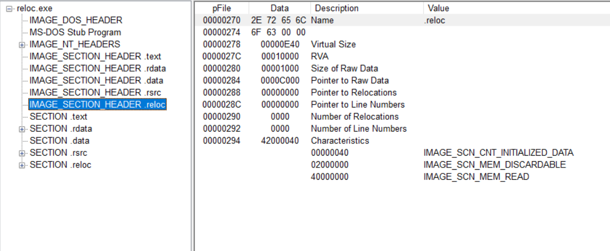

# 第14章 运行时压缩


upx后，简单看下两个文件：


压缩后所有头不变，只有节区变了。名字也变了，并且变了之后的第一个节区在文件中的大小直接为0。且第二个第三个节区都提前了。

资源节表.rsrc基本没变

# 第15章 调试upx后的notepad

先看下原来的notepad：


刚加载进去的时候判断了头部的两个标志。

接下来分析upx后的notepad：


刚进去有个pushad，意思是将eax到edi的所有保存到栈

下面介绍几个常用的跟踪快捷键：

-   ctrl+f7：反复执行步入，有显示
-   ctrl+f8：反复执行步过，有显示

## 第一个循环：


就是将edx中的东西一字节一字节的放入edi所指的地方，而edi所指的正是第一个节区，upx0

下好断点，f9跳出循环

## 第二个循环

比较大，不贴了。

就是从esi所指的地方（第二个节区）依次取值，经过一些运算后，放到edi所指的地方（第一个节区 ）

## 第三个循环


## 第四个循环；


就是一直设置IAT表了

# 第16章 基址重定位

这里还是使用notepad来演示

**ImageBase = 0x100 0000**

因为ASLR的原因，随机加载：


上面红框的都是text节区的IAT区域，


使硬编码在 程序中的内存地址随当前加载地址变化而改变的处理过程叫重定位。

可以比较下在内存与文件：


随机加的地址是：0xA01000。

文件中是以ImageBase为基准，


## 重定位的原理

原理：

>   -   在程序中查找硬编码的位置
>   -   读取后，减去ImageBase(VA->RVA)
>   -   之后加上实际的加载地址 ，（转为VA）

重要的就是查找的过程，会用到PE中的重定位表。重定位表：记录硬编码地址偏移的列表。


第六个`struct IMAGE_DATA_DIRECTORY BaseRelocationTable`:

****

基址重定位是`IMAGE_BASE_RELOCATION`的数组

```c
typedef struct _IMAGE_BASE_RELOCATION {
    DWORD   VirtualAddress;
    DWORD   SizeOfBlock;
//  WORD    TypeOffset[1];
} IMAGE_BASE_RELOCATION;
typedef IMAGE_BASE_RELOCATION UNALIGNED * PIMAGE_BASE_RELOCATION;
```

其中的TypeOffset的值就是硬编码在程序中的地址偏移


第一个`IMAGE_BASE_RELOCATION`结构体的sizseofblock是0x150，


以00结尾。

TypeOffset是2字节，16位大小，由4位的Type和12位的Offset组成，高4位为type，pe中常见的值为3：IMAGE_REL_BASED_HIGHLOW；64位中常见为A

所以低12位才是真正的偏移，该偏移的值是基于结构体中VirtualAddress的偏移。

所以有以下公式：

VirtualAddress(1000) + offset(420) = 1420(RVA)

这里程序被加载到了0xa00000

所以va = 0xa01420


刚才的RVA 0x1420，hex查看：


是0x1C120


# 第17章 删除.reloc节区

>   步骤：
>
>   1.  整理.reloc节区头
>   2.  删除.reloc节区
>   3.  修改image_file_header
>   4.  修改image_optional_header


## 删除.reloc节区头



从0x270到0x297全删，


改为：


## 删除.reloc节区

从上面的pointer to raw data 看出文件偏移为0xc000

删除掉

## 修改 IMAGE_FILE_HEADER

要修改 number of section：为4


## 修改IMAGE_OPTIONAL_HEADER

修改sizeofimage


之前知道reloc的virtualsize为E40，所以要减去section alignment:0x1000

为0x10000


这样就能正常运行了：


