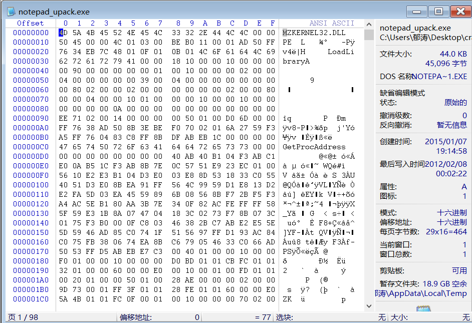
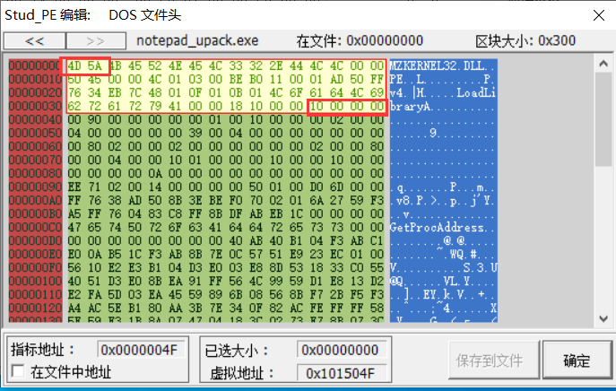
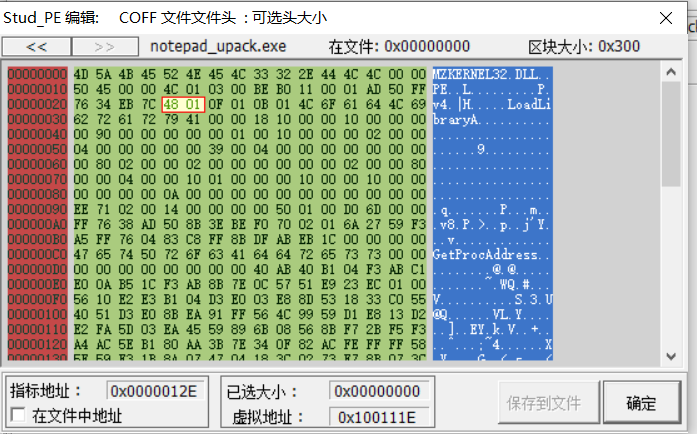

# 第18章 UPack PE文件头分析

upack：一款PE文件的运行时压缩器，用一种非常独特的方式对PE头进行变形。

正常的pe分析关键无法正常读取pe文件头，这里使用Stud_PE这款软件

正常的notepad的就不看了，下面是UPAck后的：

可以看出都是乱的，并不是正常的结构

## 分析

### 重叠文件头

IMAGE_DOS_HEADER有两个重要的成员：e_magic和e_lfanew

可以看到，e_lfanew是0x10，这样就把MZ文件头和PE头重叠在一起了。

### IMAGE_FILE_HEADERS.SizeofOptionalHeader

这个是指下面IMAGE_OPTIONAL_HEADER的大小，原来是0xE0，

IMAGE_OPTIONAL_HEADER的大小有很多，所以额外有这么一个标识。

现在，改为了0x148：

实际上并不是IMAGE_OPTIONAL_HEADER紧跟着后面是IMAGE_SECTION_HEADER.

准确点说是IMAGE_OPTIONAL_HEADER的起始加上SizeofOptionalHeader才是IMAGE_SECTION_HEADER

