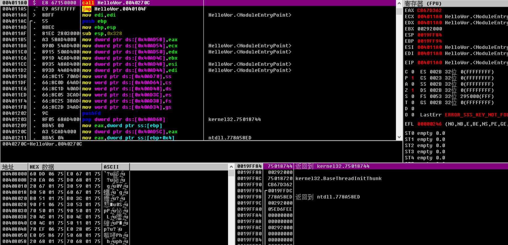
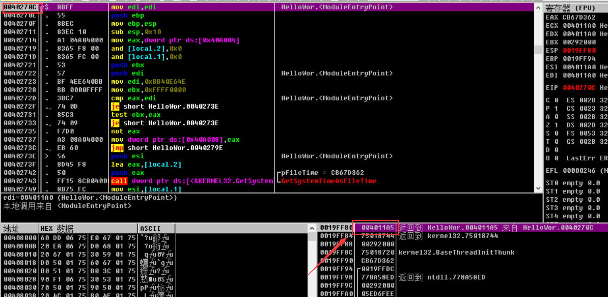
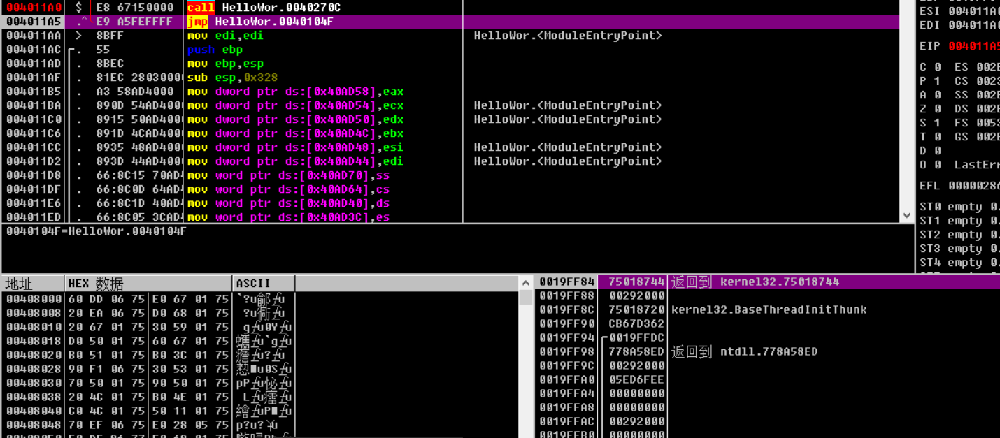
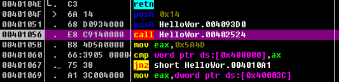
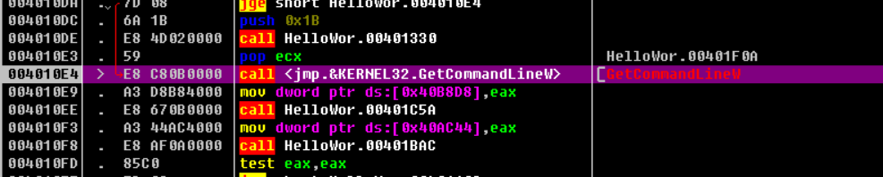
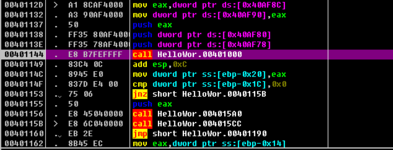
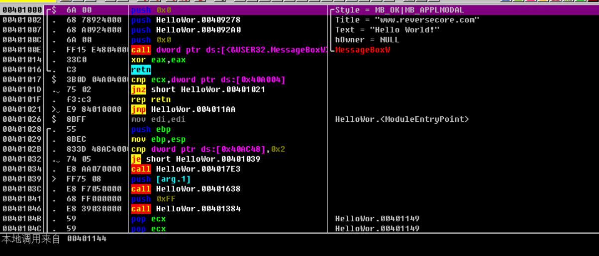
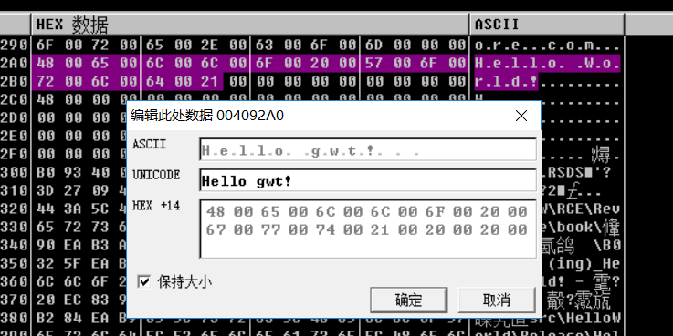
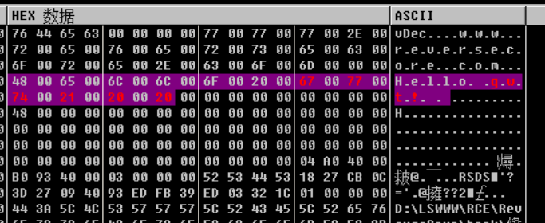
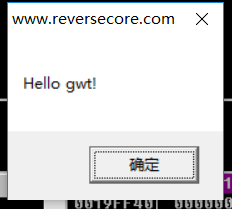

# 第二章

odb：

-   Ctrl+F2 重新调试
-   f7：步入，f8：步过
-   ctrl+F9：一直运行，知道ret

拿helloworld.exe来演示：

刚进去的EP：

先是个call，，然后是jmp

call会将下一条指令的地址压栈：

右侧是odb的注释，红色是API，

ret后：

接下来找main函数，步入后：

继续步入，并没有发现messagebox的调用，退出该代码，继续如上步骤，会遇到：

目前不需要进入被调用的函数，步过，继续，会遇到：

调用了4001000，步入：

就是main了。

------------

修改字符串，两种方法

1.直接改缓冲区，

f9运行，成功修改

选中修改的字符串，右键复制到可执行文件，然后在右键保存文件就OK。            .

第二种就是直接修改push的地址。