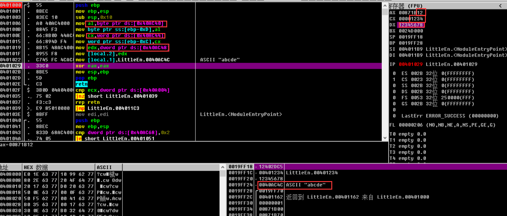

第三章

大端序与小端序

```c
    BYTE b = 0x12;
    WORD w = 0x1234;
    DWORD dw = 0x12345678;
    char s[] = "abcde";

```



|         |      |      | 大端序              | 小端序               |
| ------- | ---- | ---- | ------------------- | -------------------- |
| byte    | b    | 1    | [12]                | [12]                 |
| word    | w    | 2    | [12] [34]           | [34] [12]            |
| dword   | dw   | 3    | [12] [34] [56] [78] | [78 ] [56] [34] [12] |
| char [] | str  | 6    | a b c d e \x00      | a b c d e \x00       |

大端序：内存地址低位存储数据高位

小端序：内存地址低位存储数据低位

