# 第四章 IA-32寄存器

寄存器：

-   通用寄存器
-   段寄存区
-   程序状态与控制寄存器
-   指令指针寄存器

# 第五章 栈

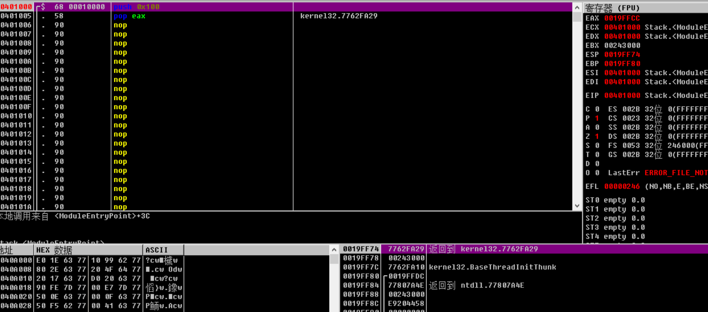

push之后：

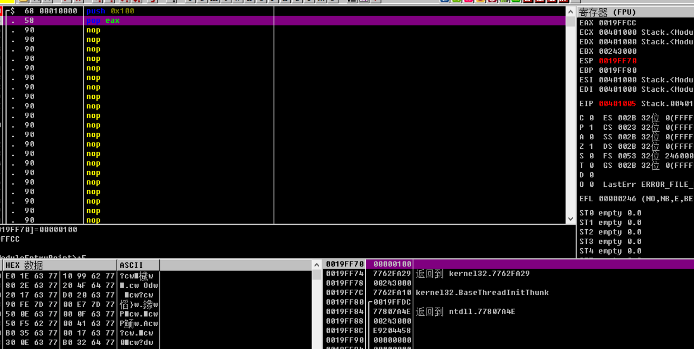

可以看到，0x100压栈，esp减4，继续pop：

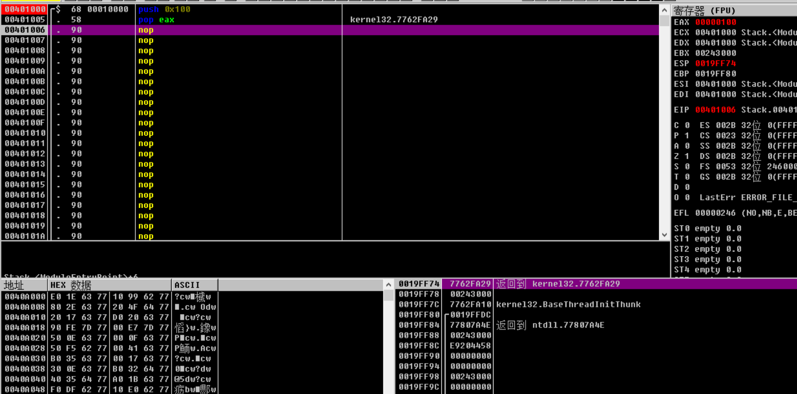

到了eax中，esp加4

# 第六章 分析 abex' crackme#1

代码很短：

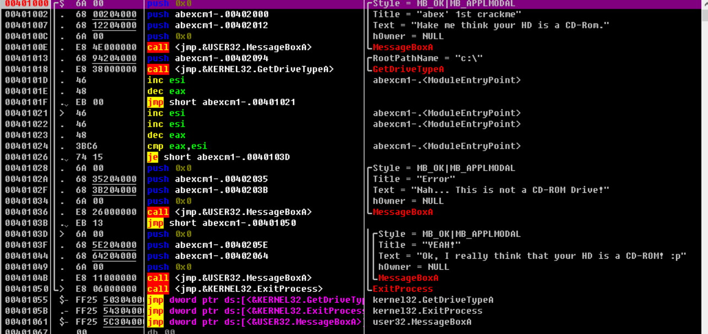

比较少，是直接用汇编写的

INC：加一

DEC：减一

CMP：改变的是ZF位

破解的话可以直接将je改为jmp实现无条件跳转

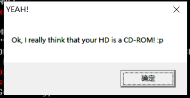

成功跳转

# 第七章 栈帧

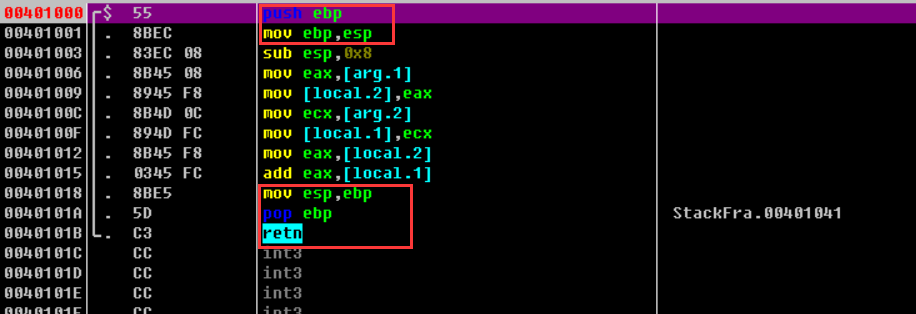

# 第八章 abex' crackme#2

用vb写的，

vb使用专用引擎：msvbvm60.dll，比如显示消息框是，要调用msgbox函数，vb调用的是msvbvm60.dll里的trcmsgbox函数，这个函数调用的user32.dll的messagebox函数，

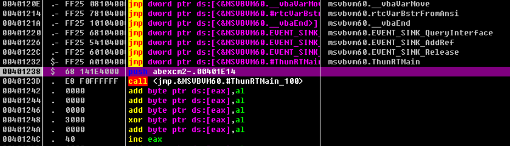

首先调用的是vb引擎的主函数：ThunRTmain，将结构体地址压栈

上面的那些jmp是vb和vc++编译器常见的间接调用

直接分析vb引擎的主函数现在还做不到，所以先搜索字符串

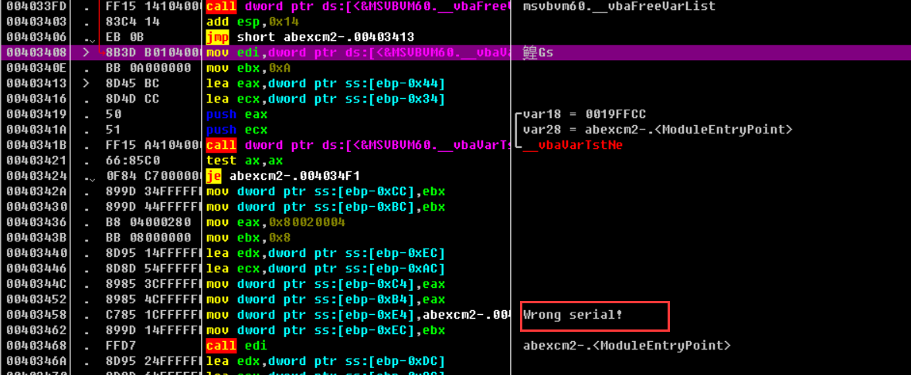

从上面跳过来的：

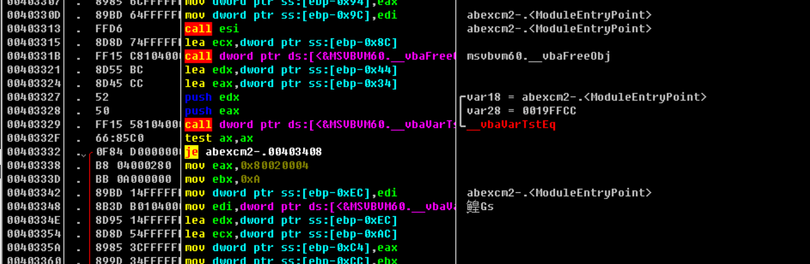

调用了vbavartsteq函数，之后比较返回值ax后，再je

test指令：若其中一个为0，则zf置1：

je：zf为1则跳转

调试到：

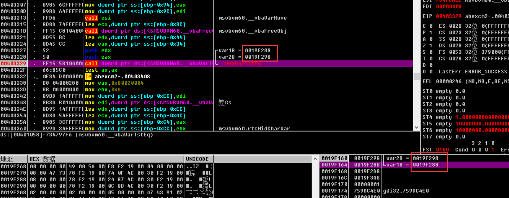

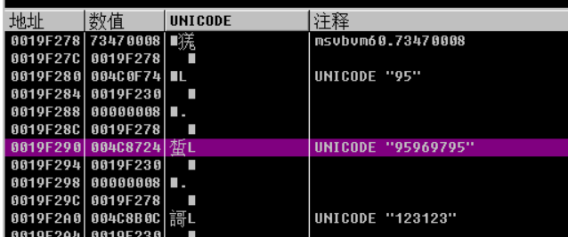

我输入的什么uname忘了，，但是重新搞一遍是可以的

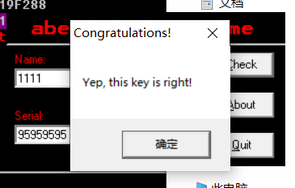

可以看出来，他是根据uname来生成serial的，

下面来分析下他是怎么算的：

他在对我们输入后会进行test之后跳转，那么一定会经过某个函数，而这个函数时check之前完成的，那么往上继续找：

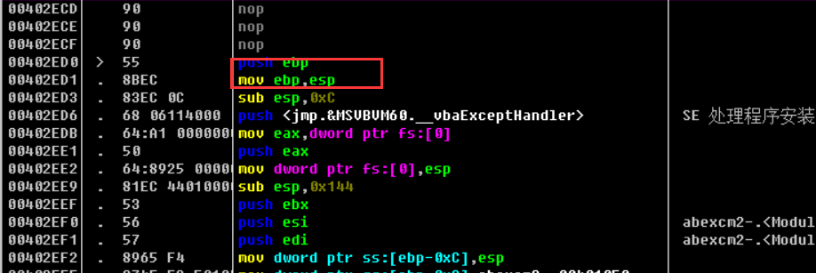

很经典的一个栈帧的代码，开始执行代码会形成栈帧，下断点，可以看到之前有很多nop，不执行动作，只消耗CPU时钟。

# 关于serial算法的部分先跳过

# 第十章 函数 调用约定

cdecl：主要是C语言，调用者负责处理栈

stdcall常用语win32api，被调用者处理栈

fastcall

# 第十一章

第一个小目标，去除对话框，先看下函数调用，一共有四个msgbox的调用

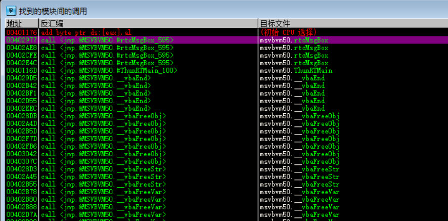

都下断点后，f9，发现停下来了但是没有到断点的地方，继续运行，f9，发现弹出对话框

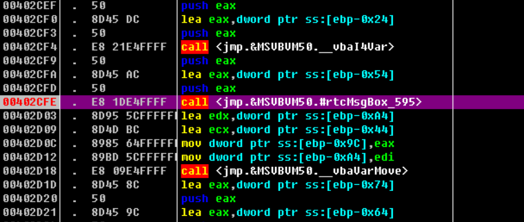

尝试将这里call改为add esp,14后nop 发现不行，addexp14是为了清理栈，14是参数长度

第二次尝试：往上看：

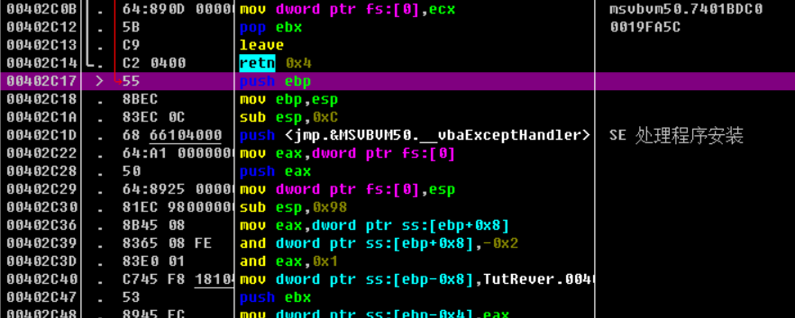

这个对话框也是其他函数调用的，如果没执行直接ret的话就不调用了，ret的话要根据传递给函数的参数大小调整栈：

保存后就没有弹窗了。

关于注册码的话，直接有提示：

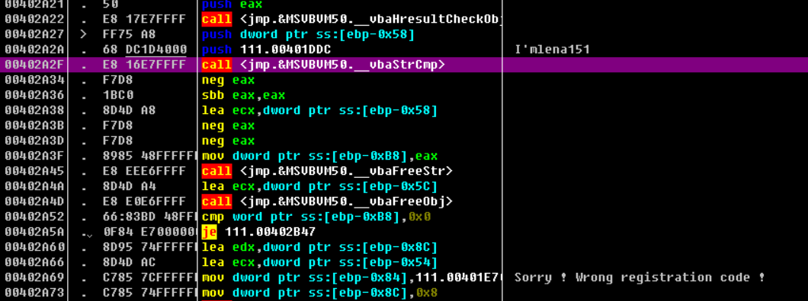

# 第十二章

